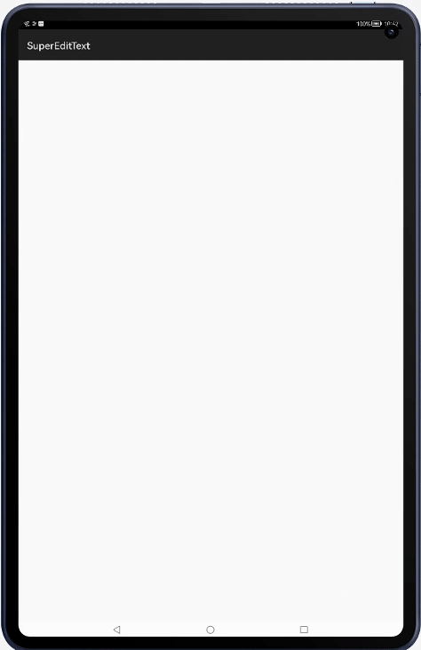
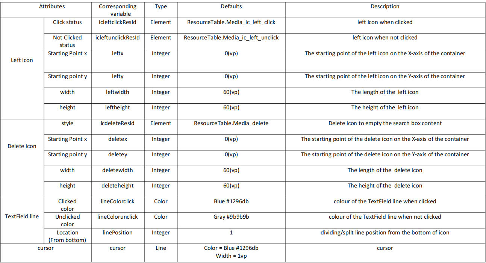

[](https://github.com/applibgroup/SuperEditText/actions/workflows/main.yml)
[](https://sonarcloud.io/summary/new_code?id=applibgroup_SuperEditText)
# SuperEditText

A HMOS library which provides SuperEditText with one-click delete feature & custom styles

## Source
Inspired by [Carson-Ho/SuperEditText](https://github.com/Carson-Ho/SuperEditText)

## Feature
A simple and easy-to-use custom EditText (including one-click delete & custom styles)
- Fresh & concise style
- Easy to use
- Secondary Programming costs are low



## Dependency
1 . For using diy_view module in sample app, include the source code and add the below dependencies in entry/build.gradle to generate hap/support.har.
```groovy
	dependencies {
		implementation project(':diy_view')
                implementation fileTree(dir: 'libs', include: ['*.har'])
                testImplementation 'junit:junit:4.13'
	}
```
2 . For using diy_view in separate application using har file, add the har file in the entry/libs folder and add the dependencies in entry/build.gradle file.
```groovy
	dependencies {
                implementation fileTree(dir: 'libs', include: ['*.har'])
                testImplementation 'junit:junit:4.13'
	}
```
3 . For using diy_view from a remote repository in separate application, add the below dependencies in entry/build.gradle file.
```groovy
        dependencies {
                implementation 'dev.applibgroup:superedittext:1.0.0'  
	        testCompile 'junit:junit:4.13'
        }
```

## Usage

#### Set Animation Attributes
- Attributes Description



### ability_main.xml
```xml
<scut.carsonho.diyview.SuperEditText
        ohos:width="400vp"
        ohos:height="match_content"
        app:ic_left_click="$media:ic_left_click"
        app:ic_left_unclick="$media:ic_left_unclick"
        app:left_x="0"
        app:left_y="0"
        app:left_width="130"
        app:left_height="130"
        app:ic_delete="$media:delete"
        app:delete_x="0"
        app:delete_y="0"
        app:delete_width="80"
        app:delete_height="80"
        app:lineColor_click="$color:colorfocus"
        app:lineColor_unclick="$color:colorDeafult"
        app:linePosition="1"
        app:cursor="$color:colorfocus"
        ohos:text_size="30fp"
        ohos:text_color="$color:cursor_color"
        />
```

## License
SuperEditText is available under the MIT license.
