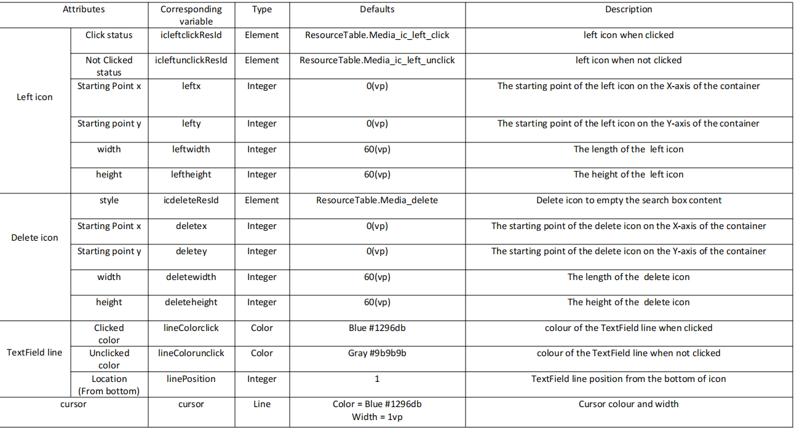

# Super_EditText

A HMOS library which provides a simple & useful DIY View for EditText

## Source
Inspired by [Carson-Ho/SuperEditText](https://github.com/Carson-Ho/SuperEditText)

## Feature
A simple and easy-to-use custom EditText (including one-click delete & custom styles)
- Fresh & concise style
- Easy to use
- Secondary Programming costs are low


## Dependency
1. For using diy_view module in sample app, include the source code and add the below dependencies in entry/build.gradle to generate hap/support.har.
```groovy
	dependencies {
		implementation project(':diy_view')
                implementation fileTree(dir: 'libs', include: ['*.har'])
                testImplementation 'junit:junit:4.13'
	}
```
2. For using diy_view in separate application using har file, add the har file in the entry/libs folder and add the dependencies in entry/build.gradle file.
```groovy
	dependencies {
		implementation fileTree(dir: 'libs', include: ['*.har'])
		testImplementation 'junit:junit:4.13'
	}
```

## Usage

#### Set Animation Attributes
- Attributes Description



### ability_main.xml
```xml
<scut.carsonho.diyview.SuperEditText
    ohos:width="200vp"
    ohos:height="match_content"
    app:ic_left_click="33554444" 
    app:ic_left_unclick="33554445" 
    app:left_x="0"
    app:left_y="0"
    app:left_width="60"
    app:left_height="60"
    app:ic_delete="33554443" 
    app:delete_x="0"
    app:delete_y="0"
    app:delete_width="80"
    app:delete_height="80"
    app:lineColor_click="$color:colorfocus" 
    app:lineColor_unclick="$color:colorDeafult" 
    app:linePosition="1"
    app:cursor="$color:colorfocus" 
    ohos:text_size="20fp"
    ohos:text_color="$color:cursor_color"
    />
```

## License
Super_EditText is available under the MIT license.
